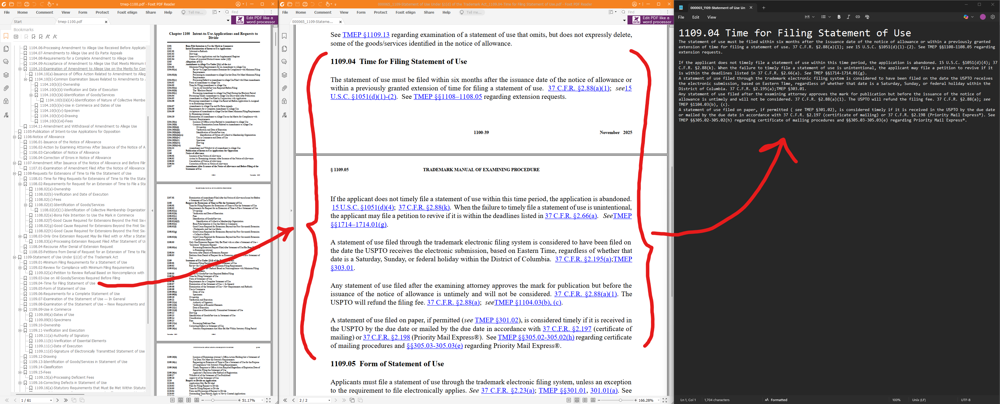

# fracture-pdf

Split PDFs by bookmark (outline) hierarchy and convert each segment to Markdown. Each bookmark becomes a separate PDF and a separate `.md` file. The Markdown is trimmed so each file contains only the section between the current bookmark’s heading and the next, with no overlap. Optionally, an LLM (Ollama) step extracts metadata (e.g. citations) from each segment and writes structured JSON; extracted refs are validated against the markdown with a configurable fuzzy match.



## Installation

```bash
npm install
```

## Usage

**From the command line** (same start/end for all files):

```bash
npx tsx index.ts <files...> -s <depth> [--end <depth>] [--output <dir>]
```

**From a JSON input** (per-file start/end):

```bash
npx tsx index.ts --input <path-to-json> [-s <depth>] [-e <depth>] [--output <dir>]
```

Or with the start script:

```bash
npm start -- <files...> -s <depth> [options]
npm start -- --input manifest.json -o out
```

### Arguments

| Argument | Description |
|----------|-------------|
| `files`  | One or more PDF file paths to split (omit when using `--input`) |

### Options

| Option | Short | Description | Default |
|--------|-------|-------------|---------|
| `--input` | `-i` | Path to JSON file listing inputs; each entry: `{ "file", "start?", "end?" }` | — |
| `--start` | `-s` | Bookmark depth to start from (1-indexed); default when using `--input` | `1` |
| `--end`   | `-e` | Bookmark depth to end at (0 = deepest) | `0` |
| `--output`| `-o` | Output directory for split PDFs | `.` |
| `--header-footer-margin <ratio>` | — | Fraction of page height to crop from top/bottom (header/footer exclusion) | `0.08` |
| `--anchor-distance-ratio <ratio>` | — | Max Levenshtein distance ratio for matching bookmark to heading | `0.4` |
| `--max-basename-length <n>` | — | Max length of output basename before truncation | `200` |
| `--index-padding <n>` | — | Number of digits for zero-padded segment index in filenames | `6` |
| `--pdf-converter <value>` | — | PDF→markdown: `builtin` or path to a script that takes `<input.pdf> <output.md>` | `builtin` |
| `--no-enrich` | — | Skip LLM metadata/enrichment extraction step | — |
| `--ollama-model <model>` | — | Ollama model for enrichment | `qwen2.5-coder:32b` |
| `--ollama-base-url <url>` | — | Ollama API base URL | `http://localhost:11434` |
| `--system-prompt <path>` | — | System prompt template (placeholder `<INPUT>` replaced by markdown) | `system.txt` |
| `--ref-match-threshold <0-1>` | — | Min similarity for extracted refs to be kept; refs not found in markdown below this are dropped | `0.85` |
| `--ref-match-step <n>` | — | Step when sliding over markdown for fuzzy ref match (1=every char, 2=every other) | `2` |
| `--ref-match-len-shorter <n>` | — | Max chars shorter than ref to try when matching substrings | `3` |
| `--ref-match-len-longer <n>` | — | Max chars longer than ref to try when matching substrings | `10` |
| `--help`  | `-h` | Show help | — |

### Examples

Split a single PDF from depth 2 down to the deepest bookmark, writing into `./out`:

```bash
npx tsx index.ts document.pdf -s 2 -o out
```

Split from the first bookmark level (depth 1) through depth 3 only:

```bash
npx tsx index.ts document.pdf -s 1 -e 3 -o ./splits
```

Process multiple files (same depth for all):

```bash
npx tsx index.ts part1.pdf part2.pdf -s 2 -o ./chapters
```

Process from a JSON manifest with per-file depths (paths relative to cwd):

```json
[
  { "file": "fixture/sample.pdf", "start": 1, "end": 0 },
  { "file": "fixture/example.pdf", "start": 2, "end": 3 }
]
```

```bash
npx tsx index.ts -i manifest.json -o out
```

Omitted `start`/`end` in an entry use the CLI `-s`/`-e` defaults.

### Output

**Layout** – For each input PDF, the tool creates a folder under the output directory named after the document (filename without `.pdf`). Under that folder:

- **`pdf/`** – One PDF per bookmark segment (pages from that bookmark up to the next).
- **`markdown/`** – One Markdown file per segment: the same pages converted (see **PDF converter** below), then trimmed so each file contains only the section between the current heading and the next.
- **`json/`** – When enrichment is enabled, one JSON file per segment with extracted metadata (e.g. `refs`: citations/references). Same basename as the segment’s PDF and Markdown.

Example for `npx tsx index.ts doc.pdf -s 1 -o out`:

```
out/
  doc/
    pdf/
      000000_Introduction.pdf
      000001_Chapter_One.pdf
      ...
    markdown/
      000000_Introduction.md
      000001_Chapter_One.md
      ...
    json/
      000000_Introduction.json
      000001_Chapter_One.json
      ...
```

**Filenames** – Each segment’s PDF, Markdown, and (if present) JSON share the same basename. The basename is taken from the **first heading** in the trimmed Markdown (cleaned for filenames and truncated per `--max-basename-length`). The zero-padded index prefix (e.g. `000042_`; configurable with `--index-padding`) keeps directory order aligned with the bookmark hierarchy. If a segment has no heading, the bookmark path is used as fallback.

**Duplicate check** – If any output file (in `pdf/`, `markdown/`, or `json/`) already exists, the tool prints an error and exits with code 1.

**PDF converter** – By default, segment PDFs are converted to markdown with the built-in engine (`@opendocsg/pdf2md`). Use `--pdf-converter <path>` to run a custom script instead; the script is invoked as `script <input.pdf> <output.md>` and must write markdown to the second path. The repo includes `src/pdf2md.sh` (e.g. using `marker_single`) as a reference implementation.

**Enrichment** – With `--no-enrich` omitted, the tool calls Ollama (model and base URL from `--ollama-model` and `--ollama-base-url`) to extract metadata from each segment’s markdown. The system prompt is loaded from `--system-prompt`; the placeholder `<INPUT>` is replaced by that segment’s markdown. Output is written to `json/<basename>.json` (e.g. a `refs` array of citations). Use `--no-enrich` to skip this step.

**Ref validation** – Extracted refs are validated against the segment’s markdown: only refs that appear in the text (exact normalized substring or fuzzy match at or above `--ref-match-threshold`) are kept. Fuzzy matching uses a sliding window over the markdown; `--ref-match-step`, `--ref-match-len-shorter`, and `--ref-match-len-longer` control the search. Refs that do not meet the threshold are dropped before writing the JSON.

**Segment rules**

- If the **next** bookmark is at the **top** of a page, that page is **excluded** from the current PDF.
- If the **next** bookmark is **not** at the top of a page, that page is **included** in the current PDF.
- Bookmarks are processed in **page order** so ranges are correct even when the outline order differs.

## License

MIT
